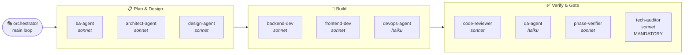
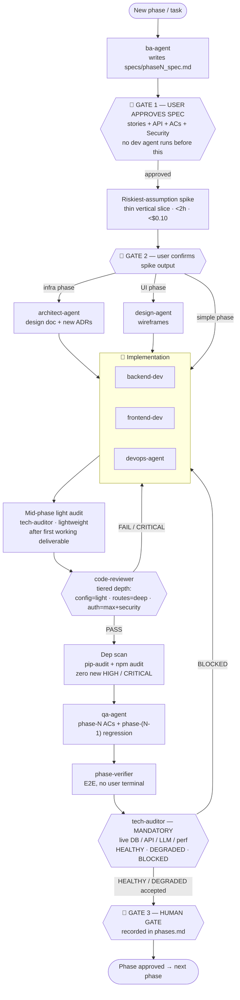

# Chveni Sopeli — Agent Roster & Workflow

> **⚠️ KEEP IN SYNC.** This document is the canonical picture of our agents and how
> a task flows through them. **Whenever the process changes** — an agent is added,
> removed, retooled, re-tiered, or the phase pipeline / gates change — **this file
> and its diagrams MUST be updated in the same change.** The rule is also recorded
> in `CLAUDE.md` so future sessions honor it.
>
> Sources of truth this file mirrors: `.claude/agents/*.md` (roster) and
> `.claude/phases.md` (pipeline & gates). If they disagree with this file, they win —
> and this file is stale and must be fixed.
>
> Last synced: **2026-08-05** (Phase 9).

---

## 1. Agent Roster

Eleven specialist agents plus the orchestrator (the main loop — me). Model tiering
is mandatory (see `.claude/decisions.md` ADR-004): `haiku` for tests/docs/DevOps,
`sonnet` for spec/design/implementation/review/audit.

| Agent | Model | Tools (skills) | Invoked when | Produces |
|---|---|---|---|---|
| **orchestrator** (main loop) | — | all | always — drives the whole pipeline | agent invocations, gate sequencing, phases.md updates |
| **ba-agent** | sonnet | Read, Glob, Grep, Bash | start of a phase, before any build | `specs/phaseN_spec.md` (stories + data model + API contract + ACs + Security) |
| **architect-agent** | sonnet | Read, Write, Edit, Glob, Grep | infra / new-service phases, after spec approved | `specs/phaseN_design.md` + new ADRs in `decisions.md` |
| **design-agent** | sonnet | Read, Write, Edit, Glob | UI phases, after spec approved | wireframes/component inventory in `specs/phaseN_design.md` |
| **backend-dev** | sonnet | Read, Write, Edit, Bash, Glob, Grep | after design doc, for Python/FastAPI work | routes, agents, models, migrations, scripts + tests |
| **frontend-dev** | sonnet | Read, Write, Edit, Bash, Glob, Grep | after design doc, for Next.js/React work | pages, map, chat UI, components |
| **devops-agent** | haiku | Read, Write, Edit, Bash, Glob | Docker / CI / deploy / env config (e.g. Phase 9) | docker-compose, Dockerfiles, railway.toml/vercel.json, env docs |
| **code-reviewer** | sonnet | Read, Glob, Grep, Bash | after any implementation, **before every commit** | `PASS / FAIL / PASS WITH NOTES` verdict with findings |
| **qa-agent** | haiku | Read, Write, Edit, Bash, Glob, Grep | after impl, before human gate | tests + per-AC PASS/FAIL (incl. phase N-1 regression) |
| **phase-verifier** | sonnet | Bash, Read | to verify a phase E2E without user touching terminal | per-AC PASS/FAIL with live evidence |
| **tech-auditor** | sonnet | Bash, Read, Glob, Grep | **mandatory** before every human gate (auto) | live DB/API/LLM audit → `HEALTHY / DEGRADED / BLOCKED` + GO/NO-GO |

**Orchestration skill:** the `phase-gate` skill chains `qa-agent` + `code-reviewer` +
curl checks into one gate report for a given phase.

---

## 2. Roster at a glance (by lifecycle stage)

---

## 3. Task / Phase Workflow

How a task flows from "new phase" to "approved", including every gate. Mirrors the
pipeline in `.claude/phases.md`.

### Gate rules
- **Gate 1 (spec):** BA spec must be user-approved *before any dev agent is invoked*.
- **Gate 2 (spike):** riskiest assumption validated with a thin slice; user confirms.
- **Commit gate:** `code-reviewer` must return PASS before *any* commit — no exceptions.
- **Dep gate (Phase 9+):** `pip-audit` + `npm audit` show zero new HIGH/CRITICAL.
- **Gate 3 (human):** `tech-auditor` MUST have run and its verdict shown before the
  human gate is presented. `BLOCKED` must be fixed first; `DEGRADED` is acceptable only
  if all HIGH findings are acknowledged. No phase advances until the gate is recorded
  in `.claude/phases.md`.

---

## 4. Tiered review depth (code-reviewer)

| Change type | Review depth |
|---|---|
| Config / env / docs | lightweight scan (correctness only) |
| New utility functions | standard (correctness + conventions) |
| New API routes | deep (correctness + security + error handling) |
| LLM agents / prompts | deep + manual eval of a sample output |
| Auth / secrets / payments | maximum + mandatory security-agent pass first |
